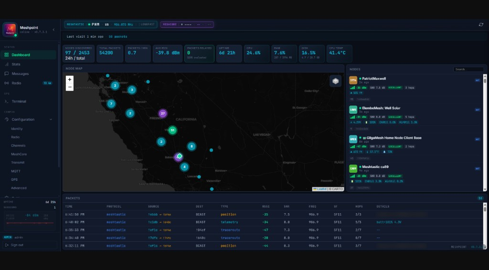
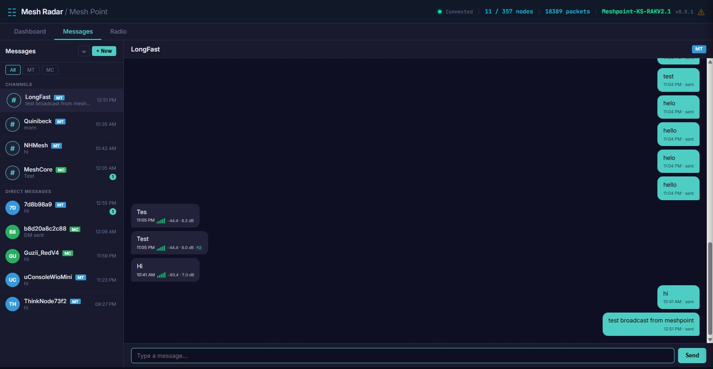
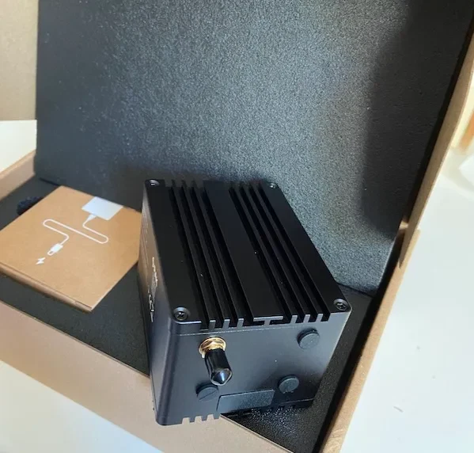

<p align="center">
  
</p>

<h1 align="center">Meshpoint</h1>

<p align="center"><strong>Open-source Meshtastic base station with native TX/RX, 8-channel concentrator, and browser-based messaging.</strong><br>Runs on Raspberry Pi 4 + SX1302/SX1303. Supports US915, EU868, ANZ915, IN865, KR920, and SG923.</p>

[](LICENSE)
[](https://www.python.org/)
[](https://www.raspberrypi.com/)
[](https://discord.gg/BnhSeFXVY8)
[](https://github.com/KMX415/meshpoint/stargazers)
[](https://github.com/KMX415/meshpoint/issues)
[](https://github.com/KMX415/meshpoint/commits/main)
[](docs/CHANGELOG.md)

### Meshradar Cloud Dashboard


### Local Dashboard


### Messaging


### Startup Log


---

## What Is This?

A Raspberry Pi-based Meshtastic base station that sends and receives messages through an SX1302/SX1303 concentrator. The concentrator decodes SF7 through SF12 in parallel on one tuned frequency (eight demod chains). It transmits natively with up to 27 dBm output. Phones and nodes see it as a regular participant on the mesh.

Everything is managed from a browser dashboard: full chat with channels and DMs, node discovery, radio configuration, and live packet feed. Also supports MeshCore traffic through a USB companion. Optionally syncs upstream to [Meshradar](https://meshradar.io) for aggregated multi-site mesh intelligence.

### Standard Node vs Meshpoint

| | Standard Node | Meshpoint |
|---|---|---|
| **Radio** | Single transceiver | SX1302 concentrator (RX + TX) |
| **Role** | Participant | Observer + participant |
| **Packet visibility** | Own traffic | Everything in range |
| **Messaging** | Phone app only | Full chat from any browser |
| **Storage** | None | SQLite with retention |
| **Dashboard** | None | Real-time web UI with radio config |

---

## Features

**Native mesh messaging.** Send and receive Meshtastic messages directly from the dashboard. Broadcast to channels, DM individual nodes, or reply in conversations. MeshCore messaging supported through the USB companion. The SX1302 handles TX using the same sync word and encryption as the mesh network: phones and nodes see your Meshpoint as a regular participant.

**Smart relay (experimental).** Re-broadcast captured Meshtastic packets through the same onboard SX1302, identity-preserving — original sender attribution and packet IDs survive, only the hop counter decrements. No second radio required. Filter by signal strength, packet type, and rate limit; share duty-cycle budget with messaging so relay traffic can never crowd out user TX. Enable via `relay.enabled: true` in `local.yaml`. See [Configuration > Smart Relay](docs/CONFIGURATION.md#smart-relay) for details and the v0.7.4 test checklist for validation steps.

**Full chat UI.** Conversations organized by channel and contact. Signal info (SNR, RSSI) on every received bubble. Duplicate badge shows how many times a relayed message was heard. Channel sidebar with LongFast, custom channels, and DM contacts. Message history persisted in SQLite.

**Radio configuration from the dashboard.** Change region, modem preset, frequency, TX power, and duty cycle without SSH. Add and remove channels with custom PSKs. Toggle TX enable/disable. All settings saved to `local.yaml` and survive restarts.

**Node discovery.** Live node cards showing every node your Meshpoint has heard: name, ID, protocol, hardware model, signal strength, battery, and last seen. Click any node to open a detail drawer with signal history and direct message.

**Dual-protocol capture.** Meshtastic and MeshCore traffic captured simultaneously. The SX1302 concentrator handles Meshtastic, while a USB MeshCore companion covers MeshCore on its own frequency.

**Full packet decoding.** 14 Meshtastic portnums decoded: TEXT, POSITION, NODEINFO, TELEMETRY, ROUTING, ADMIN, WAYPOINT, DETECTION_SENSOR, PAXCOUNTER, STORE_FORWARD, RANGE_TEST, TRACEROUTE, NEIGHBORINFO, and MAP_REPORT. 6 MeshCore message types decoded. Device roles (CLIENT, ROUTER, REPEATER, TRACKER, SENSOR) extracted from NodeInfo.

**Multi-channel decryption.** Configure private channel PSKs from the dashboard or `local.yaml`. The Meshpoint decodes traffic on those channels alongside the default key and routes messages to the correct conversation. Supports any number of channels with AES-128 or AES-256 keys.

**6 frequency regions.** US, EU_868, ANZ, IN, KR, and SG_923. Select during setup or change from the Radio settings page. MeshCore companion radios configure to match automatically.

**Real-time dashboard.** Live map with node positions, color-coded packet feed with frequency and spreading factor columns, traffic charts, signal analytics, and node cards. Accessible from any device on your network.

**GPS and split placement.** USB GPS via `gpsd` drives the Configuration → GPS skyplot. Registered coordinates (wizard pin) always feed [Meshradar](https://meshradar.io) fleet view. Meshtastic POSITION broadcasts on the LoRa mesh are separately configurable: registered pin or live GPS, with approximate (~1.1 km), precise, or hidden privacy on live. See [Configuration > Location](docs/CONFIGURATION.md#location-gps-source).

**Cloud integration.** Optional WebSocket uplink to [Meshradar](https://meshradar.io) for aggregated multi-site mesh intelligence. Fleet management, city-wide maps, and packet history across all your Meshpoints.

**Dual-protocol MQTT gateway.** Publish captured packets to community MQTT brokers and Home Assistant. Dual-protocol: Meshtastic (protobuf) and MeshCore (JSON) from a single device. Two-gate privacy model ensures private channel data never leaks. Optional JSON publishing, HA auto-discovery, and configurable location precision.

**Companion firmware from the dashboard.** Flash official Meshtastic or MeshCore USB companion firmware from Configuration → Firmware (GitHub releases via esptool), including installed-version readout before you flash. External flash still works from [meshcore.io/flasher](https://meshcore.io/flasher) or the Meshtastic web flasher when you prefer that path.

**Auto-detect hardware.** RAK Hotspot V2, SenseCap M1, and Syncrobit Chameleon (SX1302) supported; carrier board may show as generic SX1302/Pi during setup. **Bobcat Miner 300** (Rockchip RK3566 + SX1302 on Armbian) is community-validated with manual SPI/GPIO setup. **WisMesh Node** (RAK6421 Pi HAT + WisBlock SX1262, experimental) stays on its own branch `feat/wismesh-hat` (Settings → Updates → Experimental); docs are on `main`, gateway installs stay on Stable. MeshCore USB companions auto-detected on `/dev/ttyUSB*` and `/dev/ttyACM*`.

---

## Dashboard access (v0.8.0 development)

Web Terminal now requires the device-side `dashboard.web_terminal_enabled: true`
opt-in and a restart, including on upgrades. It remains admin-only. See
[device-side permissions](docs/DASHBOARD-ACCESS.md#device-side-permissions).

See the [documentation index](docs/README.md) for setup, access, hardware,
optional modules, recovery and validation guides.

**Read-only Viewer access.** Enable a Viewer login in **Settings > Auth** for trusted observers. Viewers can read the dashboard, messages and permitted configuration pages, but cannot send, delete, change configuration or mark shared conversations as read. Configuration editors are disabled and message actions are hidden. Settings and Terminal remain administrator-only. A Viewer can still change their own login password.

**Optional public view.** In **Settings > Auth > Public view**, choose which summaries to share, enable public viewing, then save. It is off by default. Signed-out visitors see only the selected Dashboard (node counts), Stats (packet counts, rate and signal averages) or Radio (configured region, frequency, bandwidth and spreading factor) pages, with an **Admin sign in** link. Anyone who can reach the dashboard address can see these summaries. Messages, node identities/locations, keys and other configuration remain behind login. Summaries refresh every 15 seconds; removing a page or disabling public viewing blocks new requests immediately. Signed-in users keep their normal dashboard.

## Optional plugins and themes (v0.8.0 development)

Source downloads require `plugin_sources_enabled: true` in `config/local.yaml`
and a restart. With downloads locked, catalog browsing and installed-module
management remain available. See [setup instructions](docs/PLUGINS.md#install-and-enable).

The `feat/v0.8.0` branch is adding optional applications without expanding the default radio installation. If you only use Meshtastic or MeshCore, keep using the existing dashboard and USB nodes. You do not need an SDR, Reticulum, or any of the optional decoder packages.

**Settings > Plugins** provides source catalogs, selected downloads, dependency reporting, enable/disable controls, and removal. Apps install disabled. Enabling an app requires a Meshpoint restart; receiver hardware remains idle until you press Start on its page. Catalog revisions are pinned to a commit, and app updates are separate from core updates.

| Optional family | What it adds | Installation impact |
| --- | --- | --- |
| RTL-SDR host | A page containing selected receiver tabs | No decoder installed automatically |
| Radio and DAB+ | Analogue and digital broadcast listening | Separate SDR and native audio tools |
| ACARS and ADS-B | Aircraft data and position reception | Separate SDR and selected decoder |
| RTL433 | Compatible wireless sensor reception | Separate SDR and `rtl_433` |
| P2000, Pagers and POCSAG | Pager reception and message views | Separate SDR and decoding tools |
| Reticulum / LXMF | Messaging, contacts, NomadNet pages, propagation and telemetry | Separate optional libraries and worker; interfaces off by default |
| DAPNET | Dedicated serial capture and packet history | Pipeline integration still in progress |

**Settings > Themes** provides the built-in palettes, a custom color editor, a device default, and catalog themes. Themes require no optional radio packages.

The receiver packages are staged in this branch's catalog source, with mocked-process checks and hardware validation still pending. They are not enabled by cloning or updating Meshpoint. Reticulum has an explicit dependency-install button using verified libraries in a separate directory. Native receiver dependencies are reported for operator setup; downloaded installers never run as root. See the [Plugin and Theme Guide](docs/PLUGINS.md) for installation, hardware sharing, updates, removal, and current limitations.

---

## Hardware

> **Requirements:** Raspberry Pi 4 or Compute Module 4, **64-bit** Raspberry Pi OS or Raspbian Lite, Python 3.12+. **Bobcat Miner 300** uses Rockchip RK3566 + community Armbian (see below). Pi 3, Pi 5 (unvalidated), x86, and 32-bit OS are not supported.

### Option A: RAK Hotspot V2 (~$60, recommended)

The easiest path. RAK/MNTD Hotspot V2 miners (model **RAK7248**) include a Pi 4, RAK2287 (SX1302), Pi HAT, metal enclosure, antenna, and power supply: everything you need. Helium's IoT network didn't pan out, so these are all over eBay for $40-70.

[Find on eBay ($30-80)](https://www.ebay.com/sch/i.html?_nkw=RAK%20Hotspot%20V2%20%2F%20MNTD&_sacat=0&_from=R40&rt=nc&_udlo=30&_udhi=80)



Remove the black tape covering the SD card slot and carefully remove SD. Flash a new card with Raspberry Pi OS 64-bit, run the install script, and you have a Meshpoint in a nice aluminum enclosure.

### Option B: SenseCap M1 (~$40-60)

Another Helium-era miner with identical compatibility. The SenseCap M1 includes a Pi 4, Seeed WM1303 concentrator (SX1303), carrier board, metal enclosure, and antenna. Some units ship with a 64GB SD card included.

[Find on eBay ($30-60)](https://www.ebay.com/sch/i.html?_nkw=SenseCap%20M1&_sacat=0&_from=R40&rt=nc&_udlo=30&_udhi=60)


Remove the 2 screws on the back panel (the side without the Ethernet/antenna ports) to access the SD card: it may be held in place by kapton tape. Flash with Raspberry Pi OS 64-bit and run the install script. USB-C power connects to the carrier board, not the Pi directly.

### Option C: Syncrobit Chameleon (CM4 eMMC, SX1302)

Retired **Syncrobit Chameleon** LoRa miners bundle a **Compute Module 4** (onboard
eMMC), an **SX1302** concentrator, enclosure, and antenna. Many units support
**PoE**. There is no microSD slot: you flash **64-bit** Raspberry Pi OS or
Raspbian Lite to eMMC once over USB using a CM4 carrier board (for example
Waveshare CM4-IO-BASE-B) and Raspberry Pi `usbboot`, then run the same
`install.sh` + `meshpoint setup` flow as a RAK V2.

Meshpoint replaces the original Chameleon firmware. Community-validated on
aarch64 Raspbian 13 (Trixie) with live Meshtastic RX/TX.

> **Step-by-step:** [Syncrobit Chameleon guide](docs/SYNCROBIT-CHAMELEON.md) and [Hardware Matrix](docs/HARDWARE-MATRIX.md).

### Option D: Build Your Own (~$85)

| Component | Price |
|-----------|-------|
| Raspberry Pi 4 (1GB+) | $35 |
| RAK2287 SX1302 + Pi HAT | ~$20* |
| 915 MHz LoRa antenna | $10 |
| MicroSD card (16GB+) | $10 |
| USB-C power supply (5V 3A) | $10 |

*\*Helium's surplus means RAK2287 concentrators and Pi HATs go for ~$20 combined on eBay.*

**Assembly:** Seat the RAK2287 on the Pi HAT, mount the HAT on the Pi GPIO header, connect the antenna. Always connect the antenna before powering on.

### Option E: WisMesh Node (RAK6421 HAT, experimental)

The [RAK WisMesh Pi Node](https://store.rakwireless.com/products/meshtastic-raspberry-pi-hat-rak6421) is a Pi HAT with a **WisBlock SX1262** LoRa module (RAK13300 standard or **RAK13302 1W** with PA). Meshpoint drives RF through **meshtasticd** (Portduino), not the SX1302 concentrator path used by Options A–D.

**Status:** User-facing docs are on **`main`**. The installer, dashboard, and capture bridge stay on the long-lived **`feat/wismesh-hat`** branch (not merged into Stable). Gateway users should stay on **`main`**.

```bash
cd /opt/meshpoint
sudo git fetch origin
sudo git checkout feat/wismesh-hat
sudo git pull
sudo ./scripts/install.sh --platform node
sudo meshpoint setup
```

> **Guides:** [WisMesh branch overview](docs/plans/WISMESH-BRANCH.md), [Gateway ↔ Node migration](docs/MIGRATE-GATEWAY-TO-NODE.md), [Hardware Matrix](docs/HARDWARE-MATRIX.md#wismesh-node-rak6421-hat-experimental).

### Option F: Bobcat Miner 300 (~$15-40 used, community path)

Retired **Bobcat Miner 300** units (models **G290** / **G295** reported) bundle a
**Rockchip RK3566** host, **64 GB eMMC**, and an onboard **SX1302** concentrator.
They are not Raspberry Pis: you flash **[Bobcat-Armbian](https://github.com/sicXnull/Bobcat-Armbian)**,
pin the vendor kernel (do not run a generic `apt upgrade`), enable the `spi5-m1`
overlay, then install Meshpoint with concentrator SPI on `/dev/spidev5.0` and a
small systemd drop-in for GPIO reset and SPI symlinks.

Community-validated (July 2026): Meshtastic TX/RX on G295; upgrade from v0.7.3.x
to v0.7.4+ reported smooth when `install.sh` skips `apt-get upgrade`. MeshCore
USB companion may need a **powered hub** (onboard micro-USB is for flashing;
OTG not confirmed on G295).

> **Step-by-step:** [Bobcat Miner 300 guide](docs/BOBCAT-300.md) and [Hardware Matrix](docs/HARDWARE-MATRIX.md).

### Option G: PiMesh-1W (experimental)

The [MeshSmith PiMesh-1W](https://meshsmith.net/wiki/products/pimesh-1w) uses a
single LoRa radio with either the Meshtastic or MeshCore Linux backend. Install
both once, then switch in **Configuration > Radio** while retaining each
protocol's settings and the normal Meshpoint UI. The HAT runs one protocol at a time.

Use the [PiMesh setup guide](docs/PIMESH.md) for board, band, region and initial
protocol selection. V2 at 915 MHz has been tested on Pi 4 / 64-bit Debian 13;
Public/private channels and DMs passed bidirectional tests on both protocols;
V1, 868 MHz and full feature parity remain unverified.
PiMesh controls appear only on provisioned PiMesh installations.

### Heltec HT-M2808 (community installation guide)

sicXnull contributed a [Heltec HT-M2808 installation guide](docs/HELTEC-M2808.md)
covering Debian Bookworm flashing, manual SPI/GPIO setup and troubleshooting.
Meshtastic TX/RX is reported by the contributor in [PR #138](https://github.com/KMX415/meshpoint/pull/138);
the setup has not been independently verified by Meshpoint maintainers.

### Pisces P100 (community setup)

Einstein PD2EMC reports working transmission and repeated service restarts
on this Pi 4-based, PoE-powered outdoor miner with a manual **GPIO 23**
concentrator reset override. See the
[Pisces P100 setup notes](docs/HARDWARE-MATRIX.md#pisces-p100-community-setup).
The report has not been independently verified by Meshpoint maintainers.

### Optional: MeshCore USB Companion

Add a Heltec V3/V4 or T-Beam running [MeshCore USB companion firmware](https://meshcore.io/flasher) to monitor MeshCore traffic alongside Meshtastic. Plug it into any USB port on the Pi -- the setup wizard auto-detects the device and configures its radio frequency for your region. You can also flash from the dashboard under Configuration → Firmware.

### Optional: Meshtastic USB node

A second Meshtastic radio (Seeed Xiao S3, Heltec, T-Beam, and similar) can listen on another preset or slot while the concentrator stays on LongFast. Dashboard: **Configuration → Serial**. Up to four USB nodes. See [USB nodes](docs/USB-NODES.md).

> **Full step-by-step guide:** See the [Onboarding Guide](docs/ONBOARDING.md) for detailed instructions covering SD flashing, Chameleon eMMC recovery, assembly, installation, MeshCore setup, USB nodes, and troubleshooting for all hardware options.

---

## Hardware and accessory links

These optional parts cover USB nodes, installation, and accessories. Choose the
radio frequency, antenna connector, and board variant that match your setup.
See the [Hardware Matrix](docs/HARDWARE-MATRIX.md) for supported configurations.

| Item | Use |
| --- | --- |
| [Heltec WiFi LoRa 32 V3 development board](https://amzn.to/4h7rIrf) | Sold by AYWHP; includes an SX1262 radio, 0.96-inch OLED display, and antenna. Optional USB node with the appropriate firmware. |
| [Heltec ESP32 LoRa 32 V4 development board](https://amzn.to/4gTLJmj) | ESP32-S3/SX1262 board with OLED display, 2MB PSRAM, and 16MB flash; optional USB node with the appropriate firmware. |
| [Seeed Studio XIAO ESP32S3 + Wio-SX1262 Meshtastic kit](https://amzn.to/4AbTKKQ) | Pre-flashed Meshtastic node with 3D-printed case, 2dBi SMA antenna, and USB-C cable. |
| [RAKwireless WisBlock Meshtastic Starter Kit, US915](https://amzn.to/3UK1Z0C) | Includes RAK19007 baseboard, RAK4631 core, LoRa/Bluetooth antennas, USB cable, and screws. Pre-flashed; battery and case are not included. |
| [Right-angle USB-A to USB-C data cables, 2-pack](https://amzn.to/4hslGTf) | Short 10cm flat cables with up/down 90-degree connectors for tight USB-node installations. |
| [Atolla powered 4-port USB 3.0 hub](https://amzn.to/4xqrQIi) | Four switched data ports, a separate charging port, and a supplied 5V/3A adapter. Connect radios to the data ports. |
| [Lexar E-Series 64GB microSDXC card](https://amzn.to/46m9VaT) | UHS-I, A1-rated storage for microSD-based gateways; listed transfer speed up to 100MB/s. |
| [Acer USB-A/USB-C SD and microSD reader](https://amzn.to/4yEY3gi) | USB 3.0 reader with separate SD/microSD slots and both host connector types for flashing installation cards. |
| [Slinkdsco 915MHz whip antennas, red, 2 sets](https://amzn.to/4j64VOY) | 17cm SMA-male antennas for 902–928MHz, with 10cm U.FL-to-SMA-female pigtails. Match your radio's band and connector. |
| [Waveshare Mini Base Board for Raspberry Pi CM4](https://amzn.to/4ircy2n) | Carrier board for CM4 Lite/eMMC modules, with a standard CM4 socket and 40-pin GPIO header. See the [Chameleon eMMC flashing guide](docs/SYNCROBIT-CHAMELEON.md). |
| [VFAN USB GPS receiver with magnetic base](https://amzn.to/4AgqHpk) | UBX-G7020KT GNSS receiver with NMEA output and a 2m USB cable; see [GPS configuration](docs/CONFIGURATION.md#location-gps-source). |

---

## Install

For **PiMesh-1W V1/V2**, use the experimental PiMesh build and explicit hardware
selection described in [PiMesh installation and protocol switching](docs/PIMESH.md).
Both protocols are installed together; choose Meshtastic or MeshCore in the
normal Configuration > Radio page afterward. PiMesh controls and its update
picker entry appear only on provisioned PiMesh installations.

The default install commands below are for SX1302/SX1303 gateways. PiMesh owners
should follow the linked PiMesh guide instead.

```bash
sudo apt update && sudo apt install -y git
sudo git clone https://github.com/KMX415/meshpoint.git /opt/meshpoint
cd /opt/meshpoint && sudo bash scripts/install.sh
```

This builds the SX1302 HAL with Meshtastic patches, sets up a Python venv, and installs the systemd service.

```bash
sudo meshpoint setup    # interactive config wizard
meshpoint status        # verify everything is running
```

Open `http://<pi-ip>:8080` for the local dashboard. On first visit (and after upgrading from v0.7.2 or earlier) you'll be prompted to set an admin password at `/setup` (8-character minimum). After that, all dashboard access requires sign-in. If you forget the password, recover via SSH with `sudo meshpoint reset-password` -- the command prompts interactively, rotates the JWT secret, and invalidates any open browser sessions.

> **First time?** The [Onboarding Guide](docs/ONBOARDING.md) walks through everything from flashing the SD card to verifying your first captured packets.

---

## Architecture

```
                                ┌─────────────────────────┐
                                │    Meshradar Cloud       │
                                │    (meshradar.io)        │
                                └────────────┬────────────┘
                                             │ WebSocket
                                             │
┌──────────┐    ┌──────────┐    ┌────────────┴────────────┐
│Meshtastic│    │ SX1302/  │    │    Meshpoint (Pi 4)      │
│ packets  │◀──▶│ SX1303   │◀──▶│                          │
│ (OTA)    │    │ RX + TX  │    │  Capture → Decode → API  │
└──────────┘    └──────────┘    │      ▲           │       │
                                │      │       Dashboard   │
┌──────────┐    ┌──────────┐    │   Messages    (port 8080)│
│ MeshCore │    │  Heltec  │    │   + Chat UI              │
│ packets  │◀──▶│  USB     │◀──▶│                          │
│ (OTA)    │    │companion │    │                          │
└──────────┘    └──────────┘    └─────────────────────────┘
```

---

## CLI

```bash
meshpoint status         # service status + config summary
meshpoint logs           # tail the service journal
meshpoint report         # full operational report (traffic, signal, system)
meshpoint restart        # restart the service
meshpoint meshcore-radio # configure MeshCore companion radio frequency
sudo meshpoint setup     # re-run config wizard
```

---

## Local API

FastAPI server on port 8080:

| Endpoint | Description |
|----------|-------------|
| `GET /api/nodes` | All discovered nodes |
| `GET /api/nodes/map` | Nodes with GPS for map display |
| `GET /api/packets` | Recent packets (paginated) |
| `GET /api/analytics/traffic` | Traffic rates and counts |
| `GET /api/analytics/signal/rssi` | RSSI distribution |
| `GET /api/device/status` | Device health and uptime |
| `GET /api/config` | Radio, TX, and channel configuration |
| `PUT /api/config/transmit` | Update TX settings |
| `PUT /api/config/identity` | Update node ID, long/short name |
| `PUT /api/config/radio` | Change region, preset, frequency |
| `POST /api/messages/send` | Send a Meshtastic or MeshCore message |
| `GET /api/messages/conversations` | Message history by conversation |
| `WS /ws` | Real-time packet + message stream |
| `GET /api/plugins` | Optional app inventory and dependency checks (admin, v0.8.0 development) |
| `PUT /api/plugins/{id}` | Enable or disable an optional app for the next restart (admin) |
| `DELETE /api/plugins/{id}` | Uninstall a disabled, unloaded app (admin) |
| `GET /api/plugin-sources/catalog` | Browse a configured, pinned catalog (admin) |
| `GET /api/themes` | Available palettes and the device default |

---

## Updating

**Optional apps on the v0.8.0 development branch:** core updates and plugin updates are separate. Disable and restart before replacing or removing an installed app. Updating a catalog pin does not update or enable its apps. Uninstall retains configuration, separately stored data, and shared native dependencies. See [plugin lifecycle details](docs/PLUGINS.md#updates-and-removal). Keep RC devices on the feature branch until release testing is complete; the stable commands below switch to `main`.

Use this block whether you are on v0.6.x, v0.7.3, or already current. `install.sh` is idempotent on existing installs: it refreshes the venv (`pip install -r requirements.txt`), removes stale pre-v0.7.0 `.so` binaries if any remain, updates sudoers and the systemd unit, and does **not** require a reboot on upgrade.

```bash
cd /opt/meshpoint
sudo git fetch origin
sudo git checkout main
sudo git pull origin main
sudo bash scripts/install.sh
sudo systemctl restart meshpoint
```

The local dashboard shows an orange update indicator when a new version is available on GitHub. After every update, hard-refresh each open dashboard tab (Ctrl+Shift+R / Cmd+Shift+R) so the browser loads the new frontend.

**First time crossing v0.7.3:** after restart, open `http://<pi-ip>:8080` and complete `/setup` to set an admin password (8 characters minimum). Forgot it later? `sudo meshpoint reset-password` from SSH.

**Already on v0.7.3+ and update often?** Prefer Settings → Updates → **Apply**, or the full SSH block above. A bare `git pull` + `systemctl restart` skips `pip install` and will miss new Python deps (for v0.7.9 that includes `esptool` for Configuration → Firmware). When release notes call out dependencies, run Apply or `install.sh`.

**From the dashboard (v0.7.4+):** sign in as admin, open Settings → Updates, pick **Stable (main)**, then **Check for updates** and **Apply** (runs `pip install -r requirements.txt` then restart; same end state as the SSH block).

See [docs/COMMON-ERRORS.md](docs/COMMON-ERRORS.md#upgrades) if the service fails to start after pulling (missing `bcrypt`, stale `.so` files, spurious reboot prompt).

---

## Troubleshooting

**Chip version 0x00:** Concentrator not responding. Check that the concentrator module is seated, SPI is enabled (`raspi-config` → Interface Options → SPI), and try a full power cycle (unplug for 10+ seconds). Normal chip versions are `0x10` (SX1302) and `0x12` (SX1303).

**No packets:** Verify antenna is connected and frequency matches your region. Check `meshpoint logs` for `lgw_receive returned N packet(s)`.

**Upstream 401:** Bad API key. Get a free one at [meshradar.io](https://meshradar.io) and re-run `sudo meshpoint setup`.

---

## Support and documentation

Start with the doc that matches what you are trying to do.

**Setup and configuration**
- **[Onboarding Guide](docs/ONBOARDING.md):** step-by-step from empty Pi to running Meshpoint
- **[Hardware Matrix](docs/HARDWARE-MATRIX.md):** RAK V2 vs SenseCap M1 vs Chameleon vs Bobcat vs DIY, WisMesh Node (experimental), Meshtastic USB nodes, MeshCore companion radios, antennas, what's not supported
- **[Bobcat Miner 300](docs/BOBCAT-300.md):** Rockchip RK3566 + Armbian repurposing (manual SPI/GPIO)
- **[Heltec HT-M2808](docs/HELTEC-M2808.md):** Community-contributed Debian Bookworm installation guide (manual SPI/GPIO)
- **[WisMesh Node (experimental)](docs/plans/WISMESH-BRANCH.md):** RAK6421 HAT, meshtasticd, long-lived `feat/wismesh-hat` branch
- **[Gateway ↔ Node migration](docs/MIGRATE-GATEWAY-TO-NODE.md):** switch between concentrator Gateway and WisMesh Node platforms
- **[PiMesh-1W (experimental)](docs/PIMESH.md):** installation, activation, MT/MC switching, updates and diagnostics
- **[Configuration Guide](docs/CONFIGURATION.md):** all config options, private channels, relay, upstream, MQTT, radio tuning
- **[USB nodes](docs/USB-NODES.md):** Meshtastic USB nodes (second preset, up to four) and MeshCore USB alongside the concentrator
- **[Radio Config Explained](docs/RADIO-CONFIG-EXPLAINED.md):** the "why" behind region, spreading factor, bandwidth, custom slots, Part 15 awareness
- **[MQTT and Meshradar](docs/MQTT-AND-MESHRADAR.md):** the two cloud paths side-by-side, what data flows where, privacy posture
- **[Home Assistant cookbook](docs/HOME-ASSISTANT-COOKBOOK.md):** copy-paste REST sensors, alerts, and broadcast automations for LAN integrations
- **[Network Watchdog](docs/NETWORK-WATCHDOG.md):** how the WiFi auto-recovery service works, default thresholds, re-enabling auto-reboot

**When something goes wrong**
- **[FAQ](docs/FAQ.md):** quick answers to common questions
- **[Common Errors](docs/COMMON-ERRORS.md):** searchable catalog of error messages with cause and fix
- **[Troubleshooting](docs/TROUBLESHOOTING.md):** longer diagnostic flows, recovery from corrupted installs

**Project**
- **[Contributor PR roadmap](docs/plans/master-pr-roadmap.md):** ordered queue for diagnostics, intelligence, and field-ops PRs
- **[Changelog](docs/CHANGELOG.md):** version history and release notes
- **[GitHub Issues](https://github.com/KMX415/meshpoint/issues)** and **[Discussions](https://github.com/KMX415/meshpoint/discussions)** for bugs and questions
- **[Discord](https://discord.gg/BnhSeFXVY8)** for real-time community support

---

## Community

- **Discord:** [discord.gg/BnhSeFXVY8](https://discord.gg/BnhSeFXVY8)
- **Website:** [meshradar.io](https://meshradar.io)
- **Issues:** [GitHub Issues](https://github.com/KMX415/meshpoint/issues)

---

## Contributing

Meshpoint is still early alpha. Pull requests are welcome, but please keep changes small and reviewable.

See [CONTRIBUTING.md](CONTRIBUTING.md) for guidelines, workflow, and PR expectations.

AI-assisted contributions are allowed, but contributors should review and understand all code before submitting.

---

## License

AGPL-3.0: see [LICENSE](LICENSE). All source code, including HAL bindings, protocol decoders, and packet builders, is published in this repository under the same license.

---

*Built for the mesh community by [Meshradar](https://meshradar.io).*


### Optional receiver regions

Optional radio modules do not choose local pager or aircraft channels for you.
Pagers, POCSAG, RTL433 and ACARS require explicit receive frequencies. Radio
starts with manual tuning; Netherlands examples are an opt-in preset library.
FM audio correction follows the US/EU starting profile where known and can be
selected explicitly. P2000 is Netherlands-specific; DAB/DAB+ currently supports
Band III only. See [receiver region settings](docs/PLUGINS.md#receiver-regions-and-local-channels)
for persistent configuration and module limitations.

---

As an Amazon Associate I earn from qualifying purchases.
